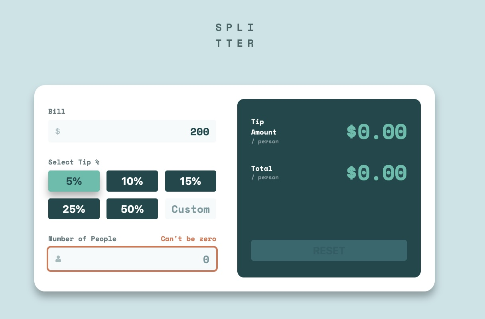

# Frontend Mentor - Tip calculator app solution

This is a solution to the [Tip calculator app challenge on Frontend Mentor](https://www.frontendmentor.io/challenges/tip-calculator-app-ugJNGbJUX). Frontend Mentor challenges help you improve your coding skills by building realistic projects.

## Table of contents

- [Overview](#overview)
  - [The challenge](#the-challenge)
  - [Screenshot](#screenshot)
  - [Links](#links)
- [My process](#my-process)
  - [Built with](#built-with)
  - [What I learned](#what-i-learned)
  - [Useful resources](#useful-resources)
- [Author](#author)

## Overview

### The challenge

Users should be able to:

- View the optimal layout for the app depending on their device's screen size
- See hover states for all interactive elements on the page
- Calculate the correct tip and total cost of the bill per person

### Screenshot

### Links

- Solution URL: [Solution](https://github.com/vince4dev/challenge12)
- Live Site URL: [Live site](https://vince4dev.github.io/challenge12/)

## My process

### Built with

- Semantic HTML5 markup
- CSS custom properties
- Flexbox
- CSS Grid
- Mobile-first workflow
- Javascript

### What I learned

During this project, I deepened my understanding of several key front‑end concepts:

- Accessibility (ARIA)

- I used aria-selected="true" to mark the active button in a group of percentage buttons and aria-pressed="true" for toggle‑style buttons.
  I made sure to pass string values ("true") to setAttribute() instead of booleans, and I consistently deselected other buttons before selecting the clicked one.

- Keyboard input filtering – I implemented a key‑down listener that blocks all characters except digits (0–9) and the decimal point (.). This ensures that only valid numeric input is accepted in the percentage field.

These lessons not only improved my technical skill set but also reinforced best practices for creating accessible, user‑friendly interfaces.

### Useful resources

- [google-webfonts-helper](https://gwfh.mranftl.com/fonts) - This helped me find the font and integrate it into the project.
- [MDN](https://developer.mozilla.org/fr/) - Resources for Developers.

## Author

- Frontend Mentor - [@vince4dev](https://www.frontendmentor.io/profile/vince4dev)
